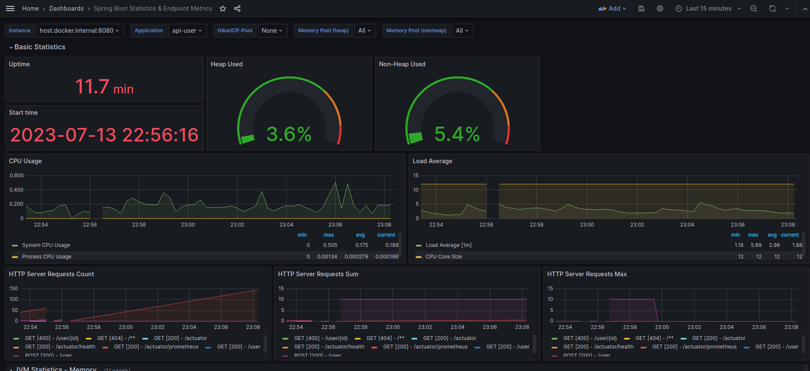
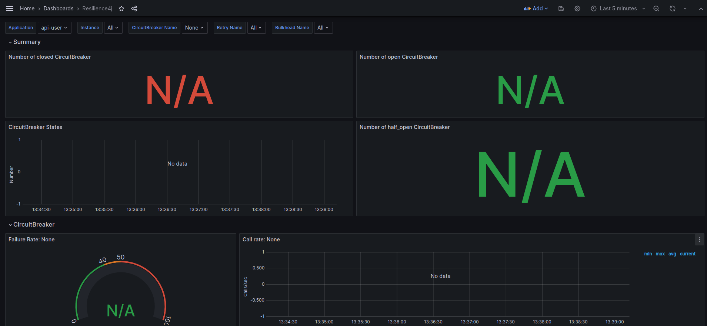

## Monitorando a aplicação Spring usando actuator, prometheus (armazenamento) e grafana para exibir os gráficos.

Importando a dashboard 14430:

Resillience4j dashboard: https://github.com/resilience4j/resilience4j/blob/master/grafana_dashboard.json

